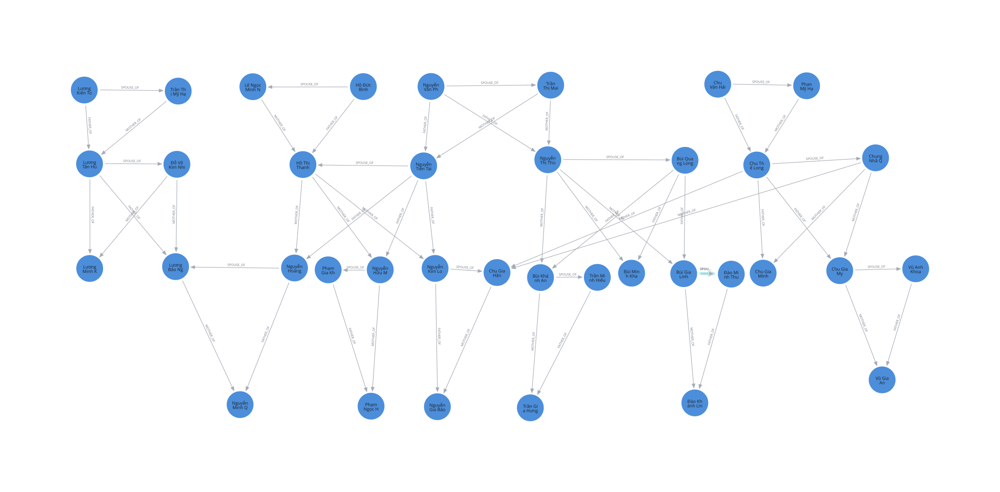

# KimLon_Family

Bài tập **Quản lý thân nhân bằng Neo4j Graph Database**.

Dự án mô hình hóa một **mạng lưới thân nhân liên thông** gồm nhiều gia đình/họ khác nhau. Các nhánh được kết nối với nhau thông qua quan hệ huyết thống và hôn nhân, phù hợp để minh họa khả năng truy vấn graph nhiều tầng của Neo4j.

## Cây quan hệ cuối cùng



- **37** node `Person`
- **58** relationship
  - **14** `SPOUSE_OF`
  - **22** `FATHER_OF`
  - **22** `MOTHER_OF`

Các nhánh Nguyễn, Hồ, Lương, Chu, Bùi, Phạm, Đào, Trần và Vũ được nối thành cùng một mạng thân nhân.

## Công nghệ

- Neo4j
- Cypher Query Language
- Neo4j Browser / Neo4j Bloom

## Mô hình dữ liệu

### Node

```text
(:Person)
```

Thuộc tính hiện dùng:

- `person_id`: mã định danh duy nhất
- `full_name`: họ tên
- `gender`: giới tính
- `birth_year`: năm sinh

Không lưu cứng thuộc tính `generation`. Thế hệ, ông/bà, cháu, anh/chị/em... được suy ra từ đường quan hệ cha/mẹ → con.

### Relationship

```text
(:Person)-[:FATHER_OF]->(:Person)
(:Person)-[:MOTHER_OF]->(:Person)
(:Person)-[:SPOUSE_OF]->(:Person)
```

#### Thuộc tính hôn nhân

```text
SPOUSE_OF {
  since,
  status,
  registered
}
```

#### Thuộc tính cha/mẹ - con

```text
FATHER_OF / MOTHER_OF {
  since,
  parent_type,
  verified
}
```

Quan hệ `SIBLING_OF` không được lưu riêng vì có thể suy ra từ cha/mẹ chung, giúp tránh dữ liệu dư thừa hoặc mâu thuẫn.

## Cấu trúc repository

```text
KimLon_Family/
├── README.md
├── cypher/
│   ├── 01_constraints.cypher
│   ├── 02_seed_people.cypher
│   ├── 03_relationships.cypher
│   └── 04_queries.cypher
└── docs/
    ├── 2001230451_NguyenKimLong.svg
    └── MO_HINH_DU_LIEU.md
```

## Thứ tự chạy

Nếu database đang chứa seed cũ và muốn tạo lại từ đầu:

```cypher
MATCH (p:Person)
DETACH DELETE p;
```

Sau đó chạy lần lượt:

1. `01_constraints.cypher` – tạo constraint/index.
2. `02_seed_people.cypher` – seed 37 thành viên.
3. `03_relationships.cypher` – tạo 58 quan hệ thân nhân.
4. `04_queries.cypher` – bộ truy vấn quản lý, phân tích quan hệ và kiểm tra huyết thống.

## Các nghiệp vụ chính

- Tra cứu thành viên.
- Tìm cha, mẹ và con.
- Suy ra anh/chị/em ruột.
- Tìm vợ/chồng và thông tin hôn nhân.
- Tìm ông bà, cháu, tổ tiên và hậu duệ.
- Tìm đường quan hệ ngắn nhất giữa hai người.
- Kiểm tra node cô lập hoặc dữ liệu quan hệ chưa đầy đủ.
- Kiểm tra hai người có tổ tiên chung.
- Quét toàn bộ các cặp đã kết hôn để phát hiện quan hệ huyết thống trong phạm vi 3 đời.

## Ghi chú

Dữ liệu được xây dựng cho mục đích học tập và minh họa Neo4j. Query kiểm tra cận huyết trong `04_queries.cypher` dựa trên cấu trúc tổ tiên trong graph và phạm vi tối đa 3 cạnh cha/mẹ; đây là kiểm tra kỹ thuật trên dữ liệu mô phỏng, không thay thế xác minh hộ tịch hoặc kết luận pháp lý.
